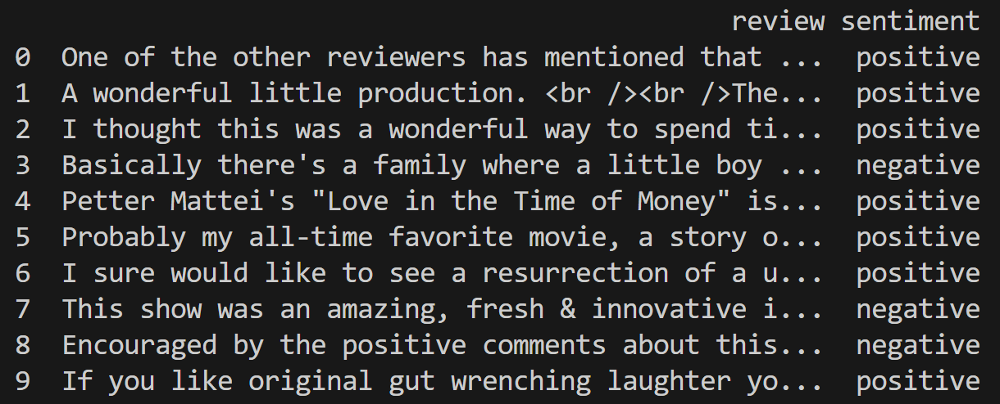
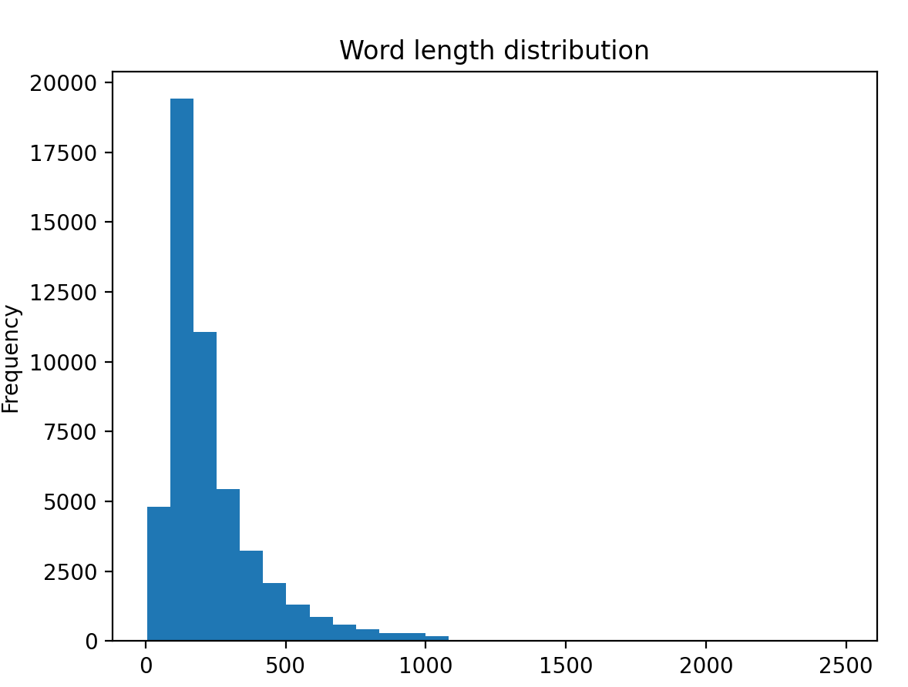

# Introduction

情感分析，又称为意见挖掘，旨在识别和提取文本数据中所表达的情感、观点和主观信息，将文本内容分类到积极、消极等情感类别中。广泛应用于商业、社交媒体等需要理解用户意见的领域。本文基于python和IMDB电影评论数据集，运用词袋(BoW)、TF-IDF、深度学习、预训练模型、大型语言模型调用等方法进行基础实验，并对模型性能进行简单对比评估。

# Dataset

## 数据集信息

IMDB电影评论数据集，包含5万条英语原始评论，每条评论含有真实的情感倾向标签，并且被平均分为了积极与消极两部分。\
数据集中前十条数据：

::: {.center}

:::

\
下载链接：

<https://www.kaggle.com/lakshmi25npathi/imdb-dataset-of-50k-movie-reviews>

## 数据处理

### 数据清洗 Data Cleaning

对于数据集中的数据，我们仅考虑其中的词汇，因此要去除特殊符号、数字等；同时将大小写归一化。

### 停用词过滤 Stop Words Removal

停用词（Stop
Words）是指在自然语言文本中出现频率很高但对文本意义贡献很小的词，将这些词语过滤掉。

### 词干提取 Stemming

将一个词语的不同形式还原成词干，通过去除前后缀来进行，将具有相同基本意义的词语归一化。

### 深度学习方法所需要的进一步数据处理 

深度学习方法不需要进行停用词过滤以及词干提取。在数据清理之后，进行词汇表的创建，每一个词语赋予独特的索引值，将评论文本转换为一串整数。大约共有92K的单词，其中前10K的单词就可以覆盖文中约95%的单词。所以仅考虑前10K的单词，并将单一评论长度限制为500词，短于500词用特殊索引填充，长于500词则只考虑前500词进行截取。

::: {.center}

:::

# Methods

## Bag of Words {#3.1}

词袋模型(Bag of
Words,简称BoW)是自然语言处理中最基础、最核心的文本表示方法之一。词袋模型将文档视为无序的词汇集合，忽略语法和语序，仅统计每个词语出现的频率，将文本转化为数值向量。其基本步骤如下：1）文本预处理，进行数据清洗、停用词过滤、词干提取以及分词；2）构建词汇表，收集测试集所有文档中的所有不重复的词语，构成词汇表，单词总数称为词汇表大小(Vocabulary
Size);3）文本向量化，将每篇文档根据各单词出现的频次结合词汇表表示为词频向量(Bag
of Words
Vector)，向量维度为词汇表大小，向量中的每个位置都对应着词汇表中的一个词，该位置的值为该单词出现的频次。例如，文档1：\"John
likes to watch movies. Mary likes movies too.\"文档2:\"Mary also likes
to watch football games.\"则构建词汇表为\[\"john\", \"likes\", \"to\",
\"watch\", \"movies\", \"mary\", \"too\", \"also\", \"football\",
\"games\"\],长度为10，则文档1的词频向量为\[1, 2, 1, 1, 2, 1, 1, 0, 0,
0\],文档2的词频向量为\[0, 1, 1, 1, 0, 1, 0, 1, 1, 1\]。

在词袋模型中，为了更好的提取复合短语的语义信息，可以使用n-grams，截取连续的n个单词作为词汇表中的一个单词，即词频向量中的一个维度。

## TF-IDF {#3.2}

TF-IDF是对于词袋模型中词频向量生成方法的改进，该方法的核心思想为：一个单词的重要性与它在当前文档中的出现次数正相关，与它在所有文档中的出现次数负相关。其基本步骤如下：1）文本预处理；2）构建词汇表；3）文本向量化，将每篇文档表示为词汇向量，向量的每个位置对应词汇表中的一个词，该位置的值为该词语的TF-IDF值。
$$TFIDF(t,d,D)=TF(t,d)*IDF(t,D) $$
$$TF(t,d)=\text{单词t在文档d中的出现频次} $$
$$IDF(t,D)=\log(\frac{1+N}{1+DF(t)})+1 $$

给定总文档库D，文档总数为N，单词t，某一文档d，DF(t)为包含单词t的文档数。根据公式[\[eq1\]](#eq1){reference-type="eqref"
reference="eq1"}[\[eq2\]](#eq2){reference-type="eqref"
reference="eq2"}[\[eq3\]](#eq3){reference-type="eqref"
reference="eq3"}计算出单词t在文档d中的TF-IDF值。IDF(Inverse Document
Frequency,逆文档频率)有多种计算方式，本文采用sklearn库中TfidfVectorizer函数的计算公式，在分子和分母上加1以避免某些词在所有文档中都不出现的情况，否则可能出现分母为0的错误。此外，sklearn库中的TfidfVectorizer函数还对最终的TF-IDF向量进行了L2范数归一化，即对于每一个文档的向量，所有值的平方和为1。

TF-IDF模型中也可以使用n-grams方法以更好提取复合短语的语义信息。

## Logistic Regression

逻辑回归(Logistic
Regression)是一种用于解决二元分类问题的统计学习方法，尽管名字中含有"回归"，但它实际上是一种分类算法。其核心任务是根据输入的特征向量预测某个事件发生的概率，并根据这个概率将数据点归类到两个类别中的一个。在本文研究的情感分析任务中，输入的特征向量即为[3.1](#3.1){reference-type="ref"
reference="3.1"},[3.2](#3.2){reference-type="ref"
reference="3.2"}中的词频向量，两个类别即为\"Positive\"\"Negative\"两种情感极性。

逻辑回归的核心工作原理如下：1）对输入的特征向量**x**进行加权求和，计算出一个线性得分z，即公式[\[eq4\]](#eq4){reference-type="eqref"
reference="eq4"},其中$\boldsymbol{\theta}$是模型需要通过训练来学习的权重；2）将线性得分z传入Sigmoid函数，将z映射成\[0,1\]之间的一个概率值，即公式[\[eq5\]](#eq5){reference-type="eqref"
reference="eq5"},若P大于等于0.5，则模型预测其类别为1，若P小于0.5，则模型预测其类型为0。
$$z=\theta_0+\sum_{i=1}^n\theta_ix_i $$
$$P(y=1|\textbf{x})=\frac{1}{1+e^{-z}} $$

逻辑回归的训练是一个优化过程，其目标是找到一组最佳的权重，使得模型的预测概率尽可能接近真实标签。训练过程主要依赖梯度下降算法来最小化交叉熵损失(Cross-Entropy
Loss)，即公式[\[eq6\]](#eq6){reference-type="eqref"
reference="eq6"},其中m为样本总数,$y^{(i)}$为第i个样本的真实标签，$p(x^{(i)})$为第i个样本输出为1的概率。本文采用sklearn中的LogisticRegression模型，初始参数$\boldsymbol{\theta}$会被赋值为不相等的近似为0的随机值，根据梯度下降算法更新参数，即公式[\[eq7\]](#eq7){reference-type="eqref"
reference="eq7"},其中$\alpha$为学习率，在本文使用的模型中根据L-BFGS优化算法调整。多次更新参数之后损失函数的值不再显著下降，此时认为模型已经收敛。此外，sklearn中的LogisticRegression模型默认使用L2正则化，以减缓模型的过拟合现象。
$$J(\boldsymbol{\theta})=-\frac{1}{m}\sum_{i=1}^m[y^{(i)}\log(p(x^{(i)}))+(1-y^{(i)})\log(1-p(x^{(i)}))] $$
$$\theta_j:=\theta_j-\alpha\frac{\partial}{\partial\theta_j}J(\boldsymbol{\theta}) $$

## Linear Support Vector Machine

线性支持向量机(Linear Support Vector
Machine,LSVM)是一种监督学习算法，主要用于解决二分类问题。其核心思想是寻找一个超平面(hyperplane)，将不同类别的样本向量分开，并使得该超平面到两边最近的样本(该样本被称为支持向量，Support
Vectors)的距离(称为间隔,Margin)最大化。训练完成后，根据输入向量与超平面的位置关系即可确认其输出。我们将标签值定义为$\pm1$,记优化得到的超平面方程为[\[eq8\]](#eq8){reference-type="eqref"
reference="eq8"},则对于样本向量$\boldsymbol{x_i}$,预测规则为[\[eq9\]](#eq9){reference-type="eqref"
reference="eq9"}。 $$\boldsymbol{w^Tx}+b=0 $$
$$f(\boldsymbol{x_i})=sign(\boldsymbol{w^Tx_i}+b) $$

LSVM优化的基本约束条件为[\[eq10\]](#eq10){reference-type="eqref"
reference="eq10"},即对于正类样本$(y_i=+1)$,要求$\boldsymbol{w^Tx_i}+b\geq+1$;对于负类样本$(y_i=-1)$,要求$\boldsymbol{w^Tx_i}+b\leq-1$,且满足$y_i(\boldsymbol{w^Tx_i}+b)=1$的数据点就是支持向量。优化目标是最大化间隔，数学上容易证明间隔大小为$\frac{2}{\|\boldsymbol{w}\|}$,其中$\|\boldsymbol{w}\|$是向量$\boldsymbol{w}$的L2范数，最大化$\frac{2}{\|\boldsymbol{w}\|}$等价于最小化$\|\boldsymbol{w}\|$，也等价于最小化$\frac{1}{2}{\|\boldsymbol{w}\|}^2$,因此，LSVM的基本优化目标为[\[eq11\]](#eq11){reference-type="eqref"
reference="eq11"} $$y_i(\boldsymbol{w^Tx_i}+b)\geq1 $$
$$\min_{w,b}\frac{1}{2}{\|\boldsymbol{w}\|}^2 \quad \text{subject to} \quad y_i(\boldsymbol{w^Tx_i}+b)\geq1 \quad \forall x=1 , \cdots , n $$

然而，仅考虑[\[eq10\]](#eq10){reference-type="eqref"
reference="eq10"}[\[eq11\]](#eq11){reference-type="eqref"
reference="eq11"}无法解决一些不是完全线性可分的问题，为此，我们引入\"软间隔\"(Soft
Margin),允许一些样本点被错误分类，但会对此进行惩罚。引入松弛变量$\xi_i\geq0$,修改约束条件为[\[eq12\]](#eq12){reference-type="eqref"
reference="eq12"},如果$\xi_i=0$，表示样本点被正确分类，且位于间隔之外，如果$0<\xi_i<1$，表示样本点被正确分类，但位于间隔之内，如果$\xi_i\geq1$，表示样本点被错误分类。同时，在优化目标中加入对松弛系数的惩罚项，即[\[eq13\]](#eq13){reference-type="eqref"
reference="eq13"},其中C是惩罚系数，在本文使用的sklearn.svm.LinearSVC模型中默认为1.0。为了最小化总损失，$\xi_i$取满足约束条件的最小值，即$max(0,1-y_i(\boldsymbol{w^Tx_i}+b))$,结合[\[eq12\]](#eq12){reference-type="eqref"
reference="eq12"}[\[eq13\]](#eq13){reference-type="eqref"
reference="eq13"},得到最终的目标函数，即带合页损失的软间隔SVM[\[eq14\]](#eq14){reference-type="eqref"
reference="eq14"}。
$$y_i(\boldsymbol{w^Tx_i}+b)\geq1-\xi_i $$
$$\min_{w,b}\frac{1}{2}{\|\boldsymbol{w}\|}^2+C\sum_{i=1}^{n}\xi_i \quad \text{subject to} \quad y_i(\boldsymbol{w^Tx_i}+b)\geq1-\xi_i $$
$$\min_{w,b}\frac{1}{2}{\|\boldsymbol{w}\|}^2+C\sum_{i=1}^{n}\max(0,1-y_i(\boldsymbol{w^Tx_i}+b)) $$

对于该目标函数，本文使用模型采用序列最小优化算法(Sequential Minimal
Optimization,SMO)。

## Multinomial Naive Bayes

多项式朴素贝叶斯(Multinomial Naive Bayes,
MNB)是一种基于贝叶斯定理专门用于处理离散特征的分类算法，其核心思想\"朴素\"指的是一个强假设：假设所有特征之间是相互独立的。在情感分析任务中，这意味着文档中某个词的出现与其他词的出现是完全独立的，没有任何关联。多项式朴素贝叶斯算法的基础是贝叶斯定理，即[\[eq15\]](#eq15){reference-type="eqref"
reference="eq15"},其中$P(C|D)$为后验概率(Posterior
Probability)，即在文档D出现的情况下属于类别C的概率，为预测时需要求解的目标；$P(D|C)$为似然度(Likelihood)，即在类别C出现的情况下，文档D出现的概率，通过训练数据进行计算；$P(C)$为先验概率(Prior
Probability)，即没有任何信息的情况下一个文档属于类别C的概率；$P(D)$为证据(Evidence)，即文档D出现的概率，在分类问题中可被视为常数不予考虑。最终的分类规则是寻找后验概率最大的类别C。
$$P(C|D)=\frac{P(D|C)P(C)}{P(D)} $$

对于情感分析问题，文档D被表示成为[3.1](#3.1){reference-type="ref"
reference="3.1"},[3.2](#3.2){reference-type="ref"
reference="3.2"}中的词频向量，例如$\boldsymbol{x}=(x_1,...,x_n)$，其中$n$为词语个数,$x_i$是词语$w_i$在上述方法中对应的取值(出现次数或TF-IDF值)。根据所有特征相互独立的假设，我们可以将后验概率表示为[\[eq16\]](#eq16){reference-type="eqref"
reference="eq16"},为方便计算，取对数得[\[eq17\]](#eq17){reference-type="eqref"
reference="eq17"}。由于最后只需比较各类别后验概率的相对大小，可以将[\[eq17\]](#eq17){reference-type="eqref"
reference="eq17"}取等作为计算结果进行分类。
$$P(C|D)\propto P(C)\prod_{i=1}^{n}P(w_i|C)^{x_i} $$
$$\log P(C|D)\propto \log P(C) + \sum_{i=1}^{n}x_i·\log P(w_i|C) $$

训练过程中，利用训练集的数据根据[\[eq18\]](#eq18){reference-type="eqref"
reference="eq18"}[\[eq19\]](#eq19){reference-type="eqref"
reference="eq19"}计算先验概率以及各词语的似然度，其中[\[eq19\]](#eq19){reference-type="eqref"
reference="eq19"}使用了拉普拉斯平滑，$\alpha$为平滑参数，默认值为1.0。预测过程，将词频向量数据带入[\[eq17\]](#eq17){reference-type="eqref"
reference="eq17"}计算\"Positive\"和\"Negative\"对应的后验概率再进行比较，选择较大的类别作为预测结果。
$$P(C)=\frac{\text{类别C的文档数}}{\text{总文档数}} $$
$$P(w_i|C)=\frac{\text{类别C文档中词语$w_i$的$x_i$之和}+\alpha}{\text{类别C文档中的$\sum_{j=1}^nx_j$之和}+\alpha · n} $$

## Multilayer Perception {#3.6}

多层感知机(Multilayer
Perception,MLP),也被称为全连接神经网络(Fully-connected Neutral
Network),是一种经典的深度学习模型，它由多个神经元层组成，其中每一层的神经元都与前一层所有的神经元相连接。在情感分析任务中，MLP的核心任务是通过多个隐藏层增加非线性组合构建一个映射关系，将输入的文档映射为情感标签。

经过[2.2.4](#sssec:2.2.4){reference-type="ref"
reference="sssec:2.2.4"}的数据处理，每条文档被处理为一个长度为500的整数序列，传入输入层(InputLayer)。在嵌入层(Embedding)中，每一个词语被转换称为一个固定大小(本文实验使用的大小为32)的嵌入向量(Embedding
Vector),转换过程中的嵌入参数需要通过学习得到，嵌入向量能够捕捉词语之间的语义关系，相似的词语在嵌入空间中具有相似的向量表示，最后嵌入层的输出为二维数据块，经过展平层(Flatten)得到一个一维向量，传入全连接隐藏层(Dense)。隐藏层中使用\"ReLU\"激活函数，并设有Dropout层，以减缓过拟合现象，输出层采用Sigmoid函数，表示评论为\"Positive\"标签的可能性，损失函数使用二元交叉熵损失[\[eq6\]](#eq6){reference-type="eqref"
reference="eq6"},优化器使用Adam。

## Recurrent Neutral Network

循环神经网络(Recurrent Neutral
Network,RNN)是一种专门用于处理序列数据的神经网络，它引入了循环结构，使得模型能够利用时序信息和上下文信息。RNN按照序列的时间步进行计算，每一个时间步t根据该时间步的输入$\boldsymbol{x_t}$以及上一时间步计算得到的隐藏状态$\boldsymbol{h_{t-1}}$计算得到该时间步的隐藏状态$\boldsymbol{h_t}$，最终输出最后一个时间步的隐藏状态$\boldsymbol{h_n}$或者所有时间步的隐藏状态序列$\boldsymbol{[h_1,...,h_n]}$。本文使用的是Keras库中的SimpleRNN,根据[\[eq20\]](#eq20){reference-type="eqref"
reference="eq20"}进行计算，其中$\boldsymbol{W_{hh}}$为隐藏状态到隐藏状态的权重矩阵，$\boldsymbol{W_{xh}}$为输入到隐藏状态的权重矩阵，$\boldsymbol{b}$为偏置向量，$\boldsymbol{h_0}$默认值为$\boldsymbol{0}$,$\tanh$是一个非线性的激活函数，可将输入压缩到(-1,1)的范围内。
$$\boldsymbol{h_t}=\tanh({\boldsymbol{W_{hh}h_{t-1}}}+\boldsymbol{W_{xh}x_t}+\boldsymbol{b}) $$
$$\tanh(x)=\frac{e^x-e^{-x}}{e^x+e^{-x}} $$

本文在SimpleRNN的基础上使用双向循环层(Bidirectional,RNN),结合了两个独立的RNN,一个从序列的开头向结尾处理，另一个从序列的结尾向开头处理，并将相同时间步的隐藏状态进行拼接，返回值为两个方向最终隐藏状态的拼接。将该拼接向量传入全连接层，经Sigmoid函数激活后进行预测。损失函数使用二元交叉熵损失[\[eq6\]](#eq6){reference-type="eqref"
reference="eq6"},优化器使用Adam。

## LSTM

长短时记忆网络(Long Short Term
Memory,LSTM)是一种特殊的RNN，它通过引入\"门控机制\"(Gating
Machanism)来精确控制信息的流动，从而能够有效地学习和记忆长距离的依赖关系。LSTM的核心是一个特殊的单元结构，由细胞状态(Cell
State)，遗忘门(Forget Gate)，输入门(Input Gate)，输出门(Output
Gate)构成。

一个LSTM单元在时间步t的计算如下：1)遗忘门，决定丢弃哪些信息，它会接收当前输入$\boldsymbol{x_t}$和上一时刻的隐藏状态$\boldsymbol{h_{t-1}}$,根据[\[eq22\]](#eq22){reference-type="eqref"
reference="eq22"}计算出遗忘向量$\boldsymbol{f_t}$,其中$\sigma$是Sigmoid函数，$\boldsymbol{[h_{t-1},x_t]}$是将两个向量拼接，$\boldsymbol{f_t}$接近0表示遗忘，接近1表示保留。
$$\boldsymbol{f_t}=\sigma(\boldsymbol{W_f \cdot [h_{t-1},x_t]}+\boldsymbol{b_f}) $$

2)输入门，决定保留哪些信息，首先根据[\[eq23\]](#eq23){reference-type="eqref"
reference="eq23"}计算输入门向量$\boldsymbol{i_t}$,决定哪些信息需要被更新；再根据[\[eq24\]](#eq24){reference-type="eqref"
reference="eq24"}计算候选细胞状态$\boldsymbol{\tilde{C_t}}$，创建一个新的候选向量用于更新细胞状态。
$$\boldsymbol{i_t}=\sigma(\boldsymbol{W_i \cdot [h_{t-1},x_t]}+\boldsymbol{b_i}) $$
$$\boldsymbol{\tilde{C_t}}=\tanh(\boldsymbol{W_C \cdot [h_{t-1},x_t]}+\boldsymbol{b_C}) $$

3)更新细胞状态，用遗忘向量逐元素乘旧的细胞状态丢弃旧信息，用输入门向量逐元素乘候选细胞状态添加新信息，相加得到新的细胞状态，即[\[eq25\]](#eq25){reference-type="eqref"
reference="eq25"}
$$\boldsymbol{C_t}=\boldsymbol{f_t \odot C_{t-1}}+\boldsymbol{i_t \odot \boldsymbol{\tilde{C_t}}} \$$

4)输出门，决定最终输出什么内容，根据[\[eq26\]](#eq26){reference-type="eqref"
reference="eq26"}计算输出们向量$\boldsymbol{o_t}$，决定细胞状态的哪一部分可以输出，根据[\[eq27\]](#eq27){reference-type="eqref"
reference="eq27"}计算最终隐藏状态$\boldsymbol{h_t}$作为当前时间步的输出以及下一时间步的部分输入。
$$\boldsymbol{o_t}=\sigma(\boldsymbol{W_o \cdot [h_{t-1},x_t]}+\boldsymbol{b_o}) $$
$$\boldsymbol{h_t}=\boldsymbol{o_t \odot \tanh(C_t)} $$

本文的实验模型使用双向循环层，结果传入全连接层经Sigmoid函数激活后进行预测。损失函数使用二元交叉熵损失[\[eq6\]](#eq6){reference-type="eqref"
reference="eq6"},优化器使用Adam。

## 1D CNN

一维卷积神经网络(1D Convolutional Neural Network,1D
CNN)是一种基于卷积运算的神经网络，其核心思想是将文本视为一维序列数据，并使用卷积核(Kernel)在序列上滑动，提取局部特征。每个文档数据经过嵌入层的处理之后转换为嵌入向量的序列，传入卷积层，每个卷积层包含多个卷积核，分别提取不同的局部特征。每个卷积核都是一个小的权重矩阵，在嵌入向量的序列上滑动计算，它会与n个词向量(n是卷积核的大小,默认为3)进行点积，产生新的特征值。每个卷积核在整个序列上滑动完之后，会生成一个一维的特征图。所有的特征图随后被传入池化层，池化层的目的是降维和突出最重要的特征，本文使用的是最大值池化(MaxPooling),在特征图上以固定大小的窗口滑动，并只保留窗口内的最大值。池化结果再次传入卷积层进行卷积，多次循环操作之后，数据被压缩成为更小更抽象的特征向量。将最后一层池化层的输出通过展平层转换为一个一维向量，输入全连接层，经Sigmoid激活后进行预测。损失函数使用二元交叉熵损失[\[eq6\]](#eq6){reference-type="eqref"
reference="eq6"},优化器使用Adam。

## BERT & RoBERTa

BERT(Bidirectional Encoder Representations from
Transformers)是一种预训练语言模型，其核心是Transformer架构中的Encoder部分，利用自注意力机制(Self-Attention
Mechanism)来理解词语之间的关系，从而生成高质量的词嵌入。BERT能够同时从左侧和右侧的上下文理解词语，并且在大规模语料库上进行了预训练，学习了丰富的语言知识，包括语法、语义和句法结构。我们无需从头训练，只需要在预训练的BERT模型上进行微调(fine-tuning)。预训练的主要任务为掩码语言模型(MLM)和下一句预测(NSP)。

在使用BERT解决情感分析任务时，我们只需进行简单的数据清洗，去除文档中的网页以及特殊字符，不需要做进一步的数据处理。文档输入首先传入嵌入层，分别进行:1)词嵌入：为词语提供基本的语义信息；2)段嵌入：为模型提供句子段落的信息;3)位置嵌入：使用固定的正弦-余弦函数生成位置向量，提供词语在序列中的位置信息。三者相加，形成一个融合了所有基础信息的最终输入嵌入向量。该序列的嵌入向量表示为一个矩阵$\boldsymbol{X}$,其中每一行$\boldsymbol{x_i}$是第i个词语的嵌入向量，传入Transformer
Encoder层。模型使用三个可学习的权重矩阵，将输入矩阵$\boldsymbol{X}$投影到三个不同的向量空间，分别得到查询矩阵$\boldsymbol{Q}$,键矩阵$\boldsymbol{K}$，值矩阵$\boldsymbol{V}$即[\[eq28\]](#eq28){reference-type="eqref"
reference="eq28"}[\[eq29\]](#eq29){reference-type="eqref"
reference="eq29"}[\[eq30\]](#eq30){reference-type="eqref"
reference="eq30"} $$\boldsymbol{Q}=\boldsymbol{XW_Q} $$
$$\boldsymbol{K}=\boldsymbol{XW_K} $$
$$\boldsymbol{V}=\boldsymbol{XW_V} $$

我们通过计算查询矩阵与键矩阵的点积，来衡量每个词语与其他所有词语的关联程度，即[\[eq31\]](#eq31){reference-type="eqref"
reference="eq31"},其中$\boldsymbol{QK^T}$是一个$n\times n$的矩阵，其中每个元素(i,j)都是$\boldsymbol{q_i}$与$\boldsymbol{k_j}$的点积，表示第i个词对第j个词的关注度，结果除以键向量维度的平方根$\sqrt{d_k}$防止梯度过大，最后使用softmax函数将注意力分数转换为(0,1)的注意力权重，且每行权重和为1。最后用注意力权重矩阵$\boldsymbol{A}$对值矩阵$\boldsymbol{V}$进行加权求和，即[\[eq32\]](#eq32){reference-type="eqref"
reference="eq32"}$\boldsymbol{Z}$是自注意力机制的最终输出矩阵，融合了句子中所有词语的信息，并且对更相关的词语给予了更高的权重。再将该矩阵输入多层Transformer
Encoder，进一步提取更高级别、更抽象的上下文信息。多次重复后，输出一个最终的向量序列。
$$\boldsymbol{A}=softmax(\frac{\boldsymbol{QK^T}}{\sqrt{d_k}}) $$
$$\boldsymbol{Z}=\boldsymbol{AV} $$

在情感分析任务中，我们使用的是BertForSequenceClassification模型，这是一个专门为序列分类任务设计的BERT模型，除了词向量序列，该模型还会在每个序列的开头添加一个特殊标记\[CLS\]，其对应的最终隐藏状态被特别训练，用于聚合整个输入序列的信息。最终向量序列中含有\[CLS\]标记的向量被传入分类头(一个全连接层),映射到二维，得到模型对积极与消极情感的预测分数，比较大小进行预测。

RoBERTa(Robustly optimized BERT pretraining
approach)在BERT的基础上，对预训练方法进行了优化。它在掩码语言模型任务中使用动态掩码，在每次向模型提供数据时，都动态生成新的掩码模式。这意味着一个句子在不同的训练周期中，被遮盖的词语是不同的。它移除了下一句预测任务。它采用了更大的训练数据和批处理大小，以及训练更长时间，取得比BERT更好的性能。

## Large Language Model

大语言模型(Large Language
Model,LLM)是具有强大的语言理解和推理能力的通用模型。我们通过设计一个清晰、明确的提示(Prompt)，将情感分析任务转化为一个自然语言问答任务描述给模型，模型利用其在海量数据中学到的通用语言理解能力，直接对文本进行分析和分类。本文使用的是\"qwen-plus\"模型。

# Experiments

## Bags of Words

使用sklearn库中的CountVectorize实现一个词、一个词+两个词、一个词+两个词+三个词的三种词袋。数据集中前40K的数据用作训练集，后10K数据用作测试集。仅通过训练集中的评论来构建词汇表，且同一词汇表将被应用于测试集。分别使用逻辑回归(Logistic
Regression)、线性支持向量机(LSVM)、朴素贝叶斯(NB)进行机器学习。评测指标为准确率(Accuracies)。

::: {#tab:Accuracies of experiments_1}
  Methods                Unigrams   Uni+Bigrams   Uni+Bi+Trigrams
  --------------------- ---------- ------------- -----------------
  Logistic Regression      88%          90%             90%
  LSVM                     86%          90%             89%
  NB                       85%          88%             89%

  : 基于词袋实验准确率结果
:::

## TFIDF

实现一个词、一个词+两个词、一个词+两个词+三个词的三种TF-IDF词袋.数据集中前40K的数据用作训练集，后10K数据用作测试集。分别使用逻辑回归(Logistic
Regression)、线性支持向量机(LSVM)、朴素贝叶斯(NB)进行机器学习。评测指标为准确率(Accuracies)。

::: {#tab:Accuracies of experiments_2}
  Methods                Unigrams   Uni+Bigrams   Uni+Bi+Trigrams
  --------------------- ---------- ------------- -----------------
  Logistic Regression      89%          89%             88%
  LSVM                     89%          90%             90%
  NB                       86%          89%             89%

  : 基于词频实验准确率结果
:::

## 深度学习方法 Deep Learning

使用[2.2.4](#sssec:2.2.4){reference-type="ref"
reference="sssec:2.2.4"}进一步处理后的数据，应用基于Tensorflow的多层感知机(MLP)、循环神经网络(RNN)、长短时神经网络(LSTM)、1D卷积神经网络(1D
CNN)进行深度学习。随机抽取80%的数据作为训练集，剩余20%数据作为测试集。评测指标为准确率(Accuracies)。

::: {#tab:Accuracies of experiments_3}
  Methods    Accuracies
  --------- ------------
  MLP          87.0%
  RNN          84.0%
  LSTM         88.9%
  1D CNN       89.7%

  : 深度学习实验准确率结果
:::

## 预训练模型以及大模型调用 Pre-trained Models & LLMs

使用基于Hugging
Face库的BertForSequenceClassification和RobertaForSequenceClassification进行本地微调后训练，随机选取70%的数据作为训练集，15%的数据作为验证集，15%的数据作为测试集。评测指标为准确率(Accuracies)。

调用\"qwen-plus\"的API，随机选取20%的数据作为测试集。

::: {#tab:Accuracies of experiments_4}
  Methods      Accuracies
  ----------- ------------
  BERT           91.9%
  RoBERTa        92.7%
  qwen-plus      94.5%

  : 预训练模型以及大模型调用实验准确率结果
:::

# Summary

根据上述实验结果汇总得到表[5](#tab:Accuracies of All_experiments){reference-type="ref"
reference="tab:Accuracies of All_experiments"},调用\"qwen-plus\"大模型具有最高的准确率94.5%,使用预训练模型进行本地微调也可以达到92%左右的较高准确率。

::: {#tab:Accuracies of All_experiments}
  Methods                           Accuracies
  -------------------------------- ------------
  Logistic Regression with BOW        90.0%
  LSVM with BOW                       90.0%
  NB with BOW                         89.0%
  Logistic Regression with TFIDF      89.0%
  LSVM with TFIDF                     90.0%
  NB with TFIDF                       89.0%
  MLP                                 87.0%
  RNN                                 84.0%
  LSTM                                88.9%
  1D CNN                              89.7%
  BERT                                91.9%
  RoBERTa                             92.7%
  qwen-plus                           94.5%

  : 实验准确率结果汇总
:::

# More Information

## References

1.<https://dropsofai.com/sentiment-analysis-with-python-bag-of-words/>

2.<https://dropsofai.com/sentiment-analysis-with-python-tfidf-features/>

3.<https://dropsofai.com/sentiment-classification-with-deep-learning-rnn-lstm-and-cnn/>

## Github Link

<https://github.com/GabrielMu2006/Sentiment-Analysis>
